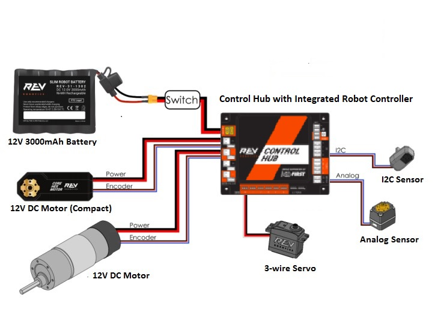

# 2024 Programming Onboarding

## Introduction

### So You Want To Program Robots…

Nice! What could possibly go wrong!?

Assuming your intentions are pure, I'm glad to have authored this guide to help you along your path to enlightenment. This is not intended to be an exhaustive, all-encompassing, "from scratch" guide. It's intended to assist you in making something meaningful happen with relatively minimal understanding and effort.

If you're interested in learning more about the fundamentals, I recommend starting with the FIRST's [Control System Introduction](https://ftc-docs.firstinspires.org/en/latest/programming_resources/shared/control_system_intro/The-FTC-Control-System.html#)

### Requirements

This guide assumes you have access to all of the following, and assumes.

- [REV Robotics Control Hub](https://www.revrobotics.com/rev-31-1595/)
- [12V 3000mAh battery](https://www.revrobotics.com/rev-31-1302/) or equivalent
- [REV Driver Hub](https://www.revrobotics.com/rev-31-1596/)
- [REV USB PS4 Compatible Gamepad](https://www.revrobotics.com/rev-31-2983/) or equivalent

It also assumes the Control Hub is wired to a battery via switch as shown in the below diagram: 

## Power

## Hardware Mapping

The first steps
### Requirements
