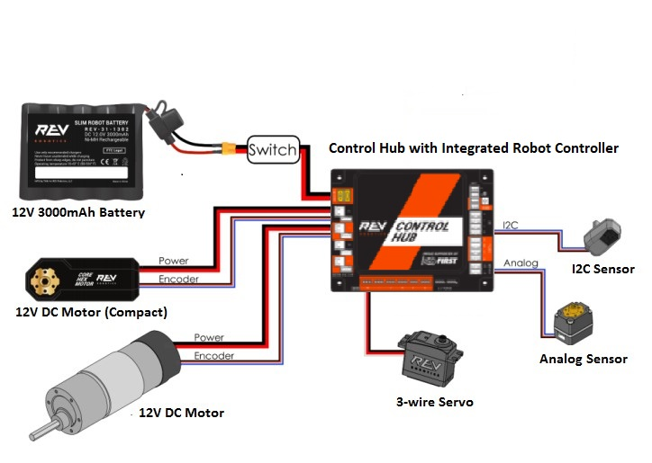

# Getting Started

Welcome to FTC robotics with the Full Metal Falcons! This section helps new members get oriented and find the right starting point for their role on the team.

## What is FTC?

FIRST Tech Challenge (FTC) is a robotics competition where teams design, build, program, and operate robots to compete in an annually-changing game. Learn more at [firstinspires.org/robotics/ftc](https://www.firstinspires.org/robotics/ftc).

## Team Communication

All team members should install [Slack](https://slack.com/downloads/windows) for team communication. Ask a mentor for the workspace invite link.

## Choose Your Path

Every team member contributes across disciplines, but most people start by focusing on one area. Pick the path that fits your interests:

| Discipline | What You'll Do | Start Here |
|------------|---------------|------------|
| **[Programming](../programming/README.md)** | Write Java code to control the robot — drive systems, autonomous routines, sensors | [Dev Environment Setup](../programming/dev-environment.md) |
| **[Building](../building/README.md)** | Design and assemble the robot — chassis, mechanisms, wiring | Building Overview *(coming soon)* |
| **[Engineering](../engineering/README.md)** | Understand the theory — drive system math, sensor physics, control loops | [Drive Systems](../engineering/README.md) |
| **[Outreach](../outreach/README.md)** | Community engagement, engineering notebook, sponsorship, branding | Outreach Overview *(coming soon)* |

## The Robot at a Glance

Every FTC robot is built around these core components:

- [REV Robotics Control Hub](https://www.revrobotics.com/rev-31-1595/) — the brain of the robot; runs your code
- [12V 3000mAh battery](https://www.revrobotics.com/rev-31-1302/) (or equivalent) — powers everything
- [REV Driver Hub](https://www.revrobotics.com/rev-31-1596/) — the driver's touchscreen interface
- [REV USB PS4 Compatible Gamepad](https://www.revrobotics.com/rev-31-2983/) (or equivalent) — driver input device

The Control Hub should be wired to the battery via a switch as shown below:

For a deeper dive into the FTC control system, see FIRST's [Control System Introduction](https://ftc-docs.firstinspires.org/en/latest/programming_resources/shared/control_system_intro/The-FTC-Control-System.html).

## New to Git and GitHub?

If you're new to programming and version control, start with the [beginners](https://github.com/FullMetalFalcons/beginners) repository for tutorials on getting started with GitHub.

## Related Topics

- [Team Management](../team-management/README.md) — how the team's GitHub organization works
- [Robot Operations](../robot-operations/README.md) — connecting to and driving the robot
- [Resources](../resources/README.md) — curated external links
